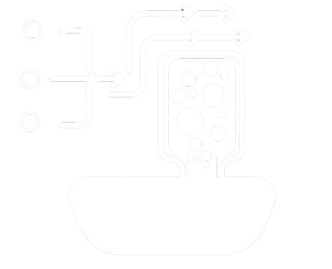

# bedflow-atlas documentation (english)

  

this is the english documentation index. the portuguese set lives in [docs/pt/](../pt/README.md). the short project overviews are [README.md](../../README.md) (en) and [README.pt.md](../../README.pt.md) (pt).

## contents

1. [getting started](getting-started.md) — install, launcher, ports, first run
2. [architecture](architecture.md) — components, folders, data flow
3. [dsl and wizard](dsl-and-wizard.md) — `.bed` language, compiler, terminal wizard
4. [frontend](frontend.md) — pages, folders, i18n, viewer
5. [backend](backend.md) — fastapi routers, sqlite, jobs
6. [pipeline and cfd](pipeline-and-cfd.md) — modeling profiles, openfoam, tutorials
7. [docker](docker.md) — compose stack and images
8. [data and paths](data-and-paths.md) — `local_data`, artifacts, gitignore

related html (opened by the wizard “documentation” option):

- [dsl/documentacao_en.html](../../dsl/documentacao_en.html)
- [dsl/documentacao.html](../../dsl/documentacao.html)

topic-specific notes already in the repo:

- [generation matrix](../geracao_modelos/README.md)
- [python vs blender engine](../motor_python_vs_blender/README.md)
- [cheese / hollow modes](../modo_queijo/README.md)
- [m2 solid interior](../modo_m2_interior_solido/README.md)
- [2d slice validation](../validacao_corte_2d/README.md)
- [docker](../../docker/README.md)
- [automation scripts](../../scripts/automation/README.md)
